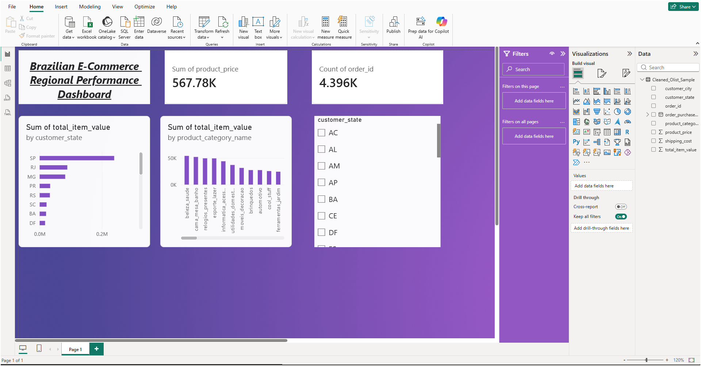
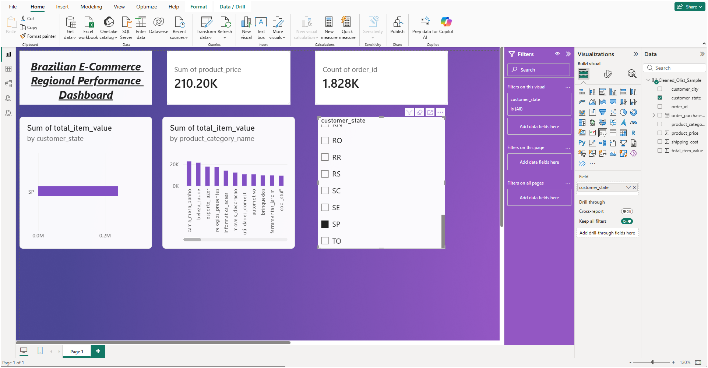

# 📊 End-to-End Brazilian E-Commerce Analytics Pipeline

An end-to-end data analytics project analyzing Brazilian E-Commerce orders to identify revenue drivers, geographic concentration, and top-performing product categories. This repository contains the complete workflow for my Analyst project, from raw database extraction to interactive Power BI presentation.

---

## 🖼️ Dashboard Previews

### 1. Main Executive Dashboard (All Regions)

### 2. State-Specific Insights (São Paulo - SP)

### 3. State-Specific Insights (Rio de Janeiro - RJ)

---

## 🛠️ Tech Stack & Workflow

1. **Data Extraction (SQL):** Extracted and joined multi-table relational data, filtering for valid completed orders.
2. **Data Cleansing (Python / Pandas):** Performed data validation, handled missing values, converted string timestamps to datetime objects, and eliminated duplicate records.
3. **Business Intelligence (Power BI):** Built an interactive executive dashboard featuring dynamic KPI cards, geographic analysis, and cross-filtering state slicers.

---

## 📈 Key Business Insights

* **Geographic Revenue Dominance:** São Paulo (SP) is the champion market, generating the highest proportion of total revenue and order volume, followed by Rio de Janeiro (RJ) and Minas Gerais (MG).
* **Category Performance:** High-ticket and everyday household categories (such as *cama_mesa_banho* and *beleza_saude*) drive the largest volume of consistent sales.
* **Strategic Logistics Recommendation:** Establish localized fulfillment hubs in the Southeast region (SP/RJ/MG) to optimize shipping overhead and delivery turnaround times.

---

## 📁 Repository Structure

* `olist_extraction.sql` — The SQL query used to extract and aggregate the master dataset from the relational database.
* `E_Commerce_Analysis.ipynb` — The Jupyter Notebook detailing data cleaning, datatype conversions, and geographic segmentation.
* `Olist_Sales_Dashboard.pbix` — The interactive Power BI dashboard report file.
* `Olist_Sample_Exploration.csv` — The initial raw data sample before Python processing.
* `Cleaned_Olist_Sample.csv` — The finalized, clean dataset used to power the Power BI dashboard.
* `*.png` — High-resolution dashboard screenshots showing different filtered states.

---

## 📦 Data Source

The master dataset used for this project is the **Brazilian E-Commerce Public Dataset by Olist**, publicly available on [Kaggle](https://www.kaggle.com/datasets/olistbr/brazilian-ecommerce). 

*Note: Cleaned sample CSV files are included directly in this repository for lightweight testing and reproducibility without needing to download the full multi-gigabyte raw database.*
